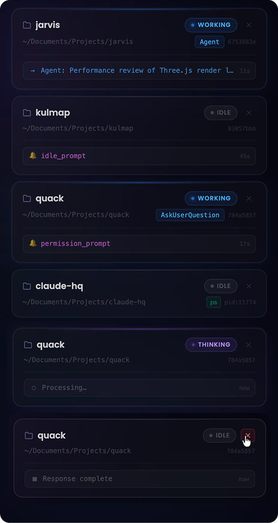
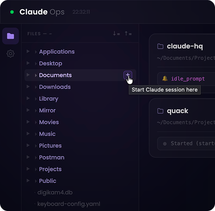
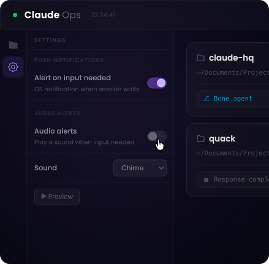

# Claude Ops

> A real-time local dashboard for monitoring and managing your [Claude Code](https://claude.ai/code) sessions.

[](LICENSE)
[](https://nodejs.org)
[](#)

See what every running agent is doing, get OS push notifications when one needs your input, browse your filesystem, and launch or kill sessions — all from one browser tab.

<br>



<br>

## Features

**Session monitoring**
- Real-time status per session: `Working`, `Thinking`, `Idle`, `Needs input`
- Current tool displayed live as Claude executes (Bash, Read, Write, WebSearch…)
- Subagent tracking — spawned agents appear as chips on the parent card
- Task progress bar from `TaskCreate` / `TaskCompleted` hook events
- Kill any session directly from its card

**File browser**
- Collapsible sidebar rooted at your home directory
- Hover any folder to reveal a launch button — opens a new Claude session in Terminal
- Right-click for context menu: launch, reveal in Finder
- Expand all / Collapse all for already-loaded nodes



**Notifications**
- OS push notifications when a session fires `PermissionRequest` or `Notification`
- In-page attention banner when any session needs confirmation
- Audio alerts with selectable sounds (Chime, Pulse, Soft ding)



**Process discovery**
- Sessions already running before the dashboard opened are discovered via `ps` and shown as `Idle`
- Hooks upgrade them to live status automatically once they fire

<br>

## Requirements

- macOS (uses `osascript` to open Terminal, `lsof` for process discovery)
- Node.js 20+
- [Claude Code](https://claude.ai/code) CLI

<br>

## Setup

### 1. Install prerequisites

```bash
# Node.js 20+ — https://nodejs.org
node --version

# Claude Code CLI
npm install -g @anthropic-ai/claude-code
```

### 2. Clone and install

```bash
git clone https://github.com/abhishek421/claude-ops.git
cd claude-ops
npm install
```

### 3. Run setup

```bash
npm run setup
```

This does three things automatically:
- Generates Web Push (VAPID) keys and writes them to `.env`
- Sets `BASE_DIR` to your home directory in `.env`
- Patches `~/.claude/settings.json` to register all 13 hooks

### 4. Start the dashboard

```bash
npm start
```

Open **http://localhost:4242** in your browser.

### 5. Start a Claude Code session

`cd` into any project and run `claude`. It appears in the dashboard immediately.

> Sessions started before `npm run setup` won't have hooks active. Start a fresh session for full coverage — existing sessions still appear via process discovery as `Idle`.

<br>

## Configuration

All config lives in `.env` (created by `npm run setup`, never committed):

| Variable | Default | Description |
|---|---|---|
| `VAPID_PUBLIC_KEY` | — | Web Push public key (auto-generated) |
| `VAPID_PRIVATE_KEY` | — | Web Push private key (auto-generated) |
| `VAPID_EMAIL` | `mailto:you@example.com` | Contact email for push provider |
| `BASE_DIR` | `$HOME` | Root directory for the file browser |
| `PORT` | `4242` | Server port |

<br>

## How Hooks Work

`npm run setup` patches `~/.claude/settings.json` with entries like:

```json
{
  "hooks": {
    "PreToolUse":        [{ "matcher": "", "hooks": [{ "type": "command", "command": "bash \"/path/to/claude-ops/hq-notify.sh\" PreToolUse",        "async": true }] }],
    "Stop":              [{ "matcher": "", "hooks": [{ "type": "command", "command": "bash \"/path/to/claude-ops/hq-notify.sh\" Stop",              "async": true }] }],
    "PermissionRequest": [{ "matcher": "", "hooks": [{ "type": "command", "command": "bash \"/path/to/claude-ops/hq-notify.sh\" PermissionRequest", "async": true }] }]
  }
}
```

All 13 hooks wired: `SessionStart`, `SessionEnd`, `UserPromptSubmit`, `PreToolUse`, `PostToolUse`, `Stop`, `PermissionRequest`, `SubagentStart`, `SubagentStop`, `TaskCreated`, `TaskCompleted`, `Notification`, `CwdChanged`.

All hooks use `async: true` — they never block Claude.

`hq-notify.sh` reads the hook JSON from stdin and POSTs it to `localhost:4242`. If the server isn't running the script exits silently.

<br>

## License

MIT — see [LICENSE](LICENSE)
